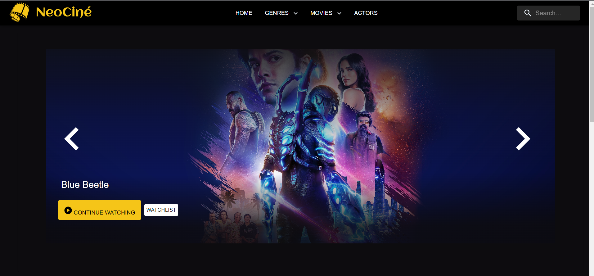
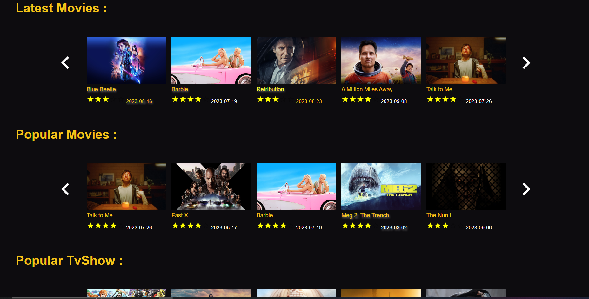
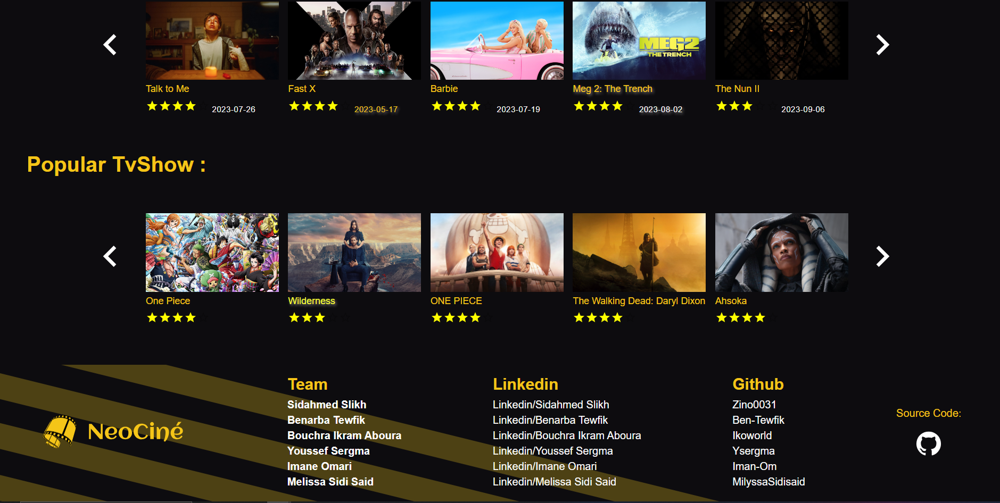

Description :
Neocine is a movie and actor information website that allows users to explore the latest movies, popular actors, and more. It provides a user-friendly interface to browse through movie details, actor profiles, and related content. Neocine is powered by The Movie Database (TMDb) API to fetch real-time movie and actor data.

Tools Used :

Next.js
Material UI
Figma (for design and prototyping)
Prettier
Husky
Commitizen
Git Workflow

Team Linkedin

- [Sidahmed Slikh](https://www.linkedin.com/in/sidahmed-zinedine)
- [Benarba Tewfik](www.linkedin.com/in/mohammed-tewfik-benarba)
- [Bouchra Ikram](https://www.linkedin.com/in/bouchra-ikram-aboura-1750b5169/)
- [Youssef Sergma](https://www.linkedin.com/in/sergma)
- [Imane Omari](https://www.linkedin.com/in/iman-omari)
- [Melissa Sidi Said](https://www.linkedin.com/in/milyssa-sidisaid-46170a232/)

---
